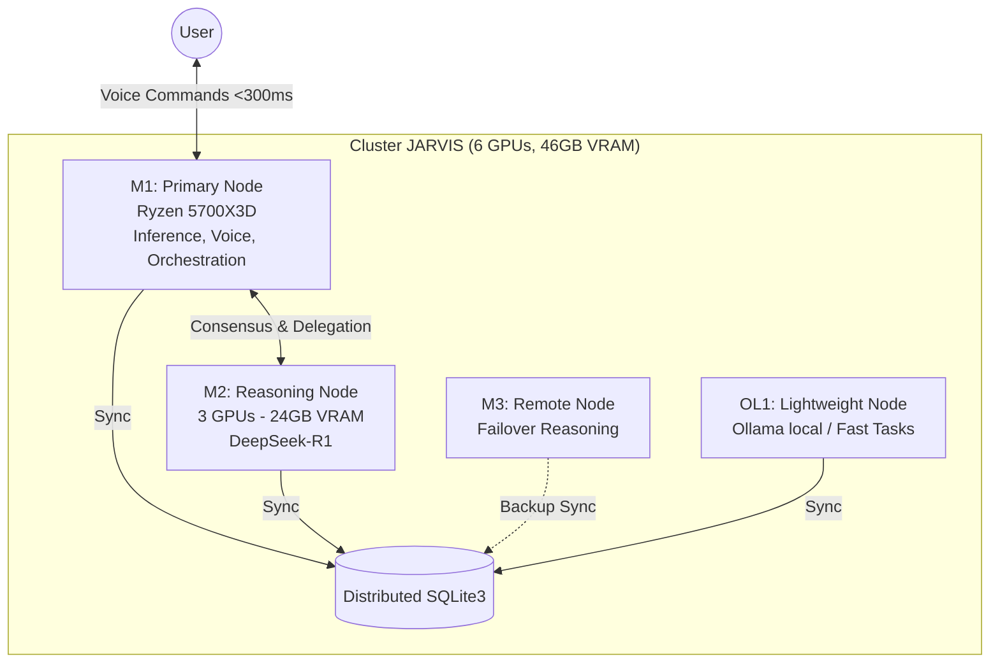

<!-- Header Banner -->

 

 

<!-- Badges Row -->

  

---

  

## `> whoami`

Independent AI engineer building **distributed autonomous systems** on multi-GPU Linux clusters. I design architectures where hundreds of AI agents coordinate, trade, speak, and self-improve — without human intervention.

**Core domains:** 
`Multi-agent orchestration` | `Voice interfaces` | `Algorithmic trading` | `Browser automation` | `GPU cluster engineering`

---

## ⚔️ Manifeste v17.0 — Singularity

> "L'industrie technologique en 2026 est marquée par la **Saaspocalypse**. Face à l'hyper-centralisation cloud, JARVIS OS propose la décentralisation absolue : 928 agents, 6 GPUs, zéro cloud. Ce n'est pas seulement une infrastructure, c'est une **architecture de liberté**."

  

---

## :rocket: What I'm Building: JARVIS OS

A 9-layer autonomous operating system spanning boot to voice, running 928+ AI agents across a 6-GPU cluster.

  

| Metric | Value |
|--------|-------|
| :robot: **Autonomous Agents** | 928+ MCP handlers across distributed nodes |
| :studio_microphone: **Voice Commands** | 2,658 recognized commands, Whisper CUDA pipeline (<300ms) |
| :wrench: **MCP Tools** | 144+ skills orchestrated via Claude Agent SDK |
| :link: **Domino Chains** | 835 automation pipelines, self-healing |
| :chart_with_upwards_trend: **Trading Engine** | 6-model consensus, MEXC Futures, 800+ pairs |
| :brain: **Inference** | 6 NVIDIA GPUs / 46GB VRAM, LM Studio + Ollama |

---

## :star2: Featured Portfolio / Vitrine

###  OS & Orchestration (JARVIS)

  
  

| Project | Description | Stack |
|---------|-------------|-------|
| [**jarvis-core**](https://github.com/Turbo31150/jarvis-core) | Unified AI orchestration engine | Python |
| [**turbo**](https://github.com/Turbo31150/turbo) | Real-time Dashboard — GPU monitoring, agent health | Python, Web |

###  Algorithmic Trading & Finance

  
  

###  Voice, Vision & UI Agents

  
  

* **[browser-mcp-orchestrator](https://github.com/Turbo31150/browser-mcp-orchestrator)**: Dual-browser DevTools MCP orchestration.

###  AI Tooling & Automation

  
  

* **[bibliotheque-prompts-multi-ia](https://github.com/Turbo31150/bibliotheque-prompts-multi-ia)**: 397+ optimized prompts.
* **[BABYSITTER-PRO-AUTOMATION](https://github.com/Turbo31150/BABYSITTER-PRO-AUTOMATION)**: Plateforme clé-en-main (Frontend, Backend, n8n).

> **Note:** Afin de conserver une vitrine claire et professionnelle, des dizaines d'autres dépôts expérimentaux et outils internes ont été archivés et passés en privé.

---

## :computer: Cluster Architecture — La Creatrice

---

## :bar_chart: GitHub Stats

---

## :envelope: Contact

---

*Building AI systems that think, trade, speak, and self-improve — autonomously.*

