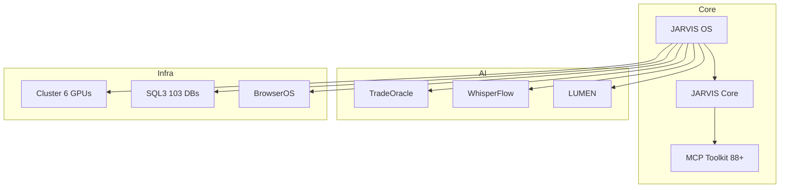

<div align="center">


# Franck Delmas — AI Systems Architect

[](https://github.com/Turbo31150)
[](https://turbo31150.github.io/franckdelmas.dev/)
[](https://linkedin.com/in/franck-hlb-80bb231b1)
[](https://codeur.com/-6666zlkh)

**I build production-grade AI systems that actually work.**

</div>


## JARVIS Ecosystem



## What I Build

| Project | Description | Stars |
|---------|-------------|-------|
| [**JARVIS OS**](https://github.com/Turbo31150/jarvis-linux) | Distributed AI Operating System — 600+ agents, 6 GPUs | ⭐3 |
| [**JARVIS Core**](https://github.com/Turbo31150/jarvis-core) | Unified orchestration — 26 modules, 9 agents, 45/45 tasks | NEW |
| [**TradeOracle**](https://github.com/Turbo31150/TradeOracle) | Multi-model AI consensus trading engine | ⭐1 |
| [**WhisperFlow**](https://github.com/Turbo31150/jarvis-whisper-flow) | Real-time Voice AI — <300ms on GPU | ⭐1 |
| [**LUMEN**](https://github.com/Turbo31150/lumen) | Live multilingual transcription — 50+ languages | |
| [**Turbo Dashboard**](https://github.com/Turbo31150/turbo) | GPU cluster monitoring — cyberpunk UI | ⭐4 |

## Infrastructure

**"La Créatrice"** — 6 NVIDIA GPUs (RTX 3080 + RTX 2060 + 4x GTX 1660S), 46GB VRAM, 3 machines.

```
M1 Master:  deepseek-r1, qwen3.5-9b, gemma-3-4b
M2 Detector: qwen3-8b, deepseek-coder, nemotron
M3 Orchestrator: deepseek-r1, mistral-7b, phi-3.1
```

## Tech Stack

`Python` `TypeScript` `CUDA` `Docker` `Linux` `React` `n8n` `MCP` `SQLite` `WebSocket`

## Hire Me

55€/h · Remote · [Portfolio](https://turbo31150.github.io/franckdelmas.dev/) · [Codeur.com](https://codeur.com/-6666zlkh)


## About Me

I'm Franck Delmas, an independent AI engineer based in France. I build **distributed autonomous systems** — AI that runs on your hardware, not in someone else's cloud.

My daily workflow: 600+ AI agents orchestrating voice commands, trading algorithms, browser automation, and multi-model inference across a cluster of 6 GPUs. Everything open source. Everything local.

## What I Can Build For You

| Service | Description | Starting at |
|---------|-------------|-------------|
| **Autonomous AI Agents** | Agents that work 24/7 — monitoring, analyzing, acting | 2,000€ |
| **Voice AI Assistants** | Real-time speech-to-action, <300ms on GPU | 3,500€ |
| **Business Automation** | Connect your tools with intelligent n8n/Python workflows | On quote |
| **AI Infrastructure** | Multi-GPU cluster setup, model deployment, optimization | 55€/h |

## How I Work

```
1. Discovery call (15 min, free) → understand your needs
2. POC in 5-7 days → working prototype to validate
3. Iterative development → demos every week
4. Delivery → documented, tested, with 1 month support
```

## My Stack in Numbers

```
┌─────────────────────────────────┐
│ 600+ autonomous AI agents       │
│ 88   MCP tool handlers          │
│ 2658 voice commands             │
│ 6    NVIDIA GPUs (46GB VRAM)    │
│ 3    machines in cluster        │
│ 21   AI models available        │
│ 103  SQLite databases           │
│ 65   n8n workflows              │
│ 320K lines of code              │
└─────────────────────────────────┘
```

## Recent Activity

- **6 freelance offers** posted on Codeur.com (9,900€ total)
- **Hackathon Airia AI Agents 2026** — Multi-Agent Treasury Risk Platform
- **624 LinkedIn followers** with active engagement on AI/orchestration topics
- **20 open source repos** with Mermaid diagrams, badges, and documentation


---

MIT License · © 2026 Franck Delmas

---

## My Journey

I started like many others — on Windows, writing scripts that barely worked, restarting machines when things broke. The turning point came when I discovered Linux and realized that an operating system could be something you *shape* rather than something that shapes you. I wiped my main drive, installed Ubuntu, and never looked back. Within weeks I was compiling kernels, configuring GRUB entries, and running headless servers from my living room. It was messy, educational, and deeply satisfying.

The GPU chapter started with a single NVIDIA GTX 1660 Super. I wanted to run local AI models — not because cloud APIs were expensive (though they are), but because I believe in sovereignty over your own compute. One GPU became two, two became four, and before long I had built "La Creatrice" — a 3-machine, 6-GPU cluster with 46GB of combined VRAM. Each machine has a role: M1 is the master node running the orchestrator, M2 handles fast inference, and M3 runs deep reasoning models. The cluster communicates over my local network, with automatic failover when a node goes down or a GPU overheats.

Today, JARVIS manages over 600 autonomous agents across this infrastructure. Voice commands, trading algorithms, browser automation, podcast generation, Telegram bots — all running locally, all orchestrated by code I wrote. The journey from "how do I install Python on Linux" to "my cluster is running 21 AI models simultaneously" took about two years. I am still learning every day, and that is the point. The moment you stop being a beginner at something, you are not pushing hard enough.

---

## Open Source Philosophy

Every line of code I write for JARVIS is public. Not because I have to — because I believe the best way to prove your skills is to show your work. When a potential client or collaborator visits my GitHub, they do not see a curated highlight reel. They see the real thing: messy commits from 2AM debugging sessions, README files that evolved from one paragraph to full documentation, and architecture decisions — both good and questionable — laid bare for anyone to examine.

Open source is also how I learn. By publishing my MCP toolkit (88+ handlers), my trading engine (TradeOracle), and my voice pipeline (WhisperFlow), I invite feedback from people who think differently than I do. Some of the best improvements to JARVIS came from issues filed by strangers who found edge cases I never considered. The ecosystem grows because it is open, and it is robust because it is scrutinized.

I also believe that AI infrastructure should not be gatekept. Too many developers think you need $10,000/month in cloud credits to build serious AI systems. My entire cluster cost less than a used car, and it runs models that compete with cloud offerings. By open-sourcing everything — including the deployment scripts, the systemd services, the thermal management logic — I hope to show that local AI is not just viable, it is preferable for many use cases.

---

## Metrics & Achievements

| Metric | Value |
|--------|-------|
| **LinkedIn Followers** | 624 (and growing, active engagement on AI/orchestration topics) |
| **Open Source Repos** | 20 public repositories on GitHub |
| **Lines of Code** | 7,542 in JARVIS Core alone, 320K+ across the ecosystem |
| **GitHub Stars** | 12 total across all projects |
| **MCP Handlers** | 88+ production handlers |
| **Autonomous Agents** | 600+ running in production daily |
| **GPU Cluster** | 6 NVIDIA GPUs, 46GB VRAM, 3 machines |
| **AI Models** | 21 models available across the cluster |
| **SQLite Databases** | 103 databases managed |
| **Voice Commands** | 2,658 unique voice commands recognized |
| **n8n Workflows** | 65 automated workflows |
| **Test Coverage** | 29/29 core tests passing, 45/45 tasks complete |
| **Hackathons** | Airia AI Agents 2026 — Multi-Agent Treasury Risk Platform |
| **Freelance Offers** | 6 active offers on Codeur.com (9,900 EUR total) |

---

## Contact & Availability

I am based in **Toulouse, France** (CET/CEST timezone, UTC+1 in winter, UTC+2 in summer).

**Availability:**
- **Monday to Friday:** 9:00 - 18:00 CET — available for calls, pair programming, and synchronous collaboration
- **Evenings & Weekends:** Async communication only — I respond to emails and messages within 24 hours
- **Emergency support:** For active clients with support contracts, I provide a 4-hour response time SLA during business hours

**How to reach me:**
- **Email:** Available on my [Portfolio](https://turbo31150.github.io/franckdelmas.dev/) contact page
- **LinkedIn:** [linkedin.com/in/franck-hlb-80bb231b1](https://linkedin.com/in/franck-hlb-80bb231b1) — I accept all connection requests from developers and tech professionals
- **Codeur.com:** [codeur.com/-6666zlkh](https://codeur.com/-6666zlkh) — for freelance project inquiries
- **GitHub:** [github.com/Turbo31150](https://github.com/Turbo31150) — issues and discussions are welcome on any repository

**Response time expectations:**
- LinkedIn messages: within 12 hours
- Codeur.com inquiries: within 24 hours
- GitHub issues: within 48 hours (faster for critical bugs)
- Discovery calls: typically scheduled within 2-3 business days

**Languages:** French (native), English (professional, fluent in technical contexts)


---

## Try JARVIS Right Now

```bash
# Clone and run in 30 seconds
git clone https://github.com/Turbo31150/jarvis-core
cd jarvis-core && pip install -r requirements.txt

# Health check — see your cluster status instantly
python3 jarvis.py health
# Output:
# ┌──────────────────────────────────────────────────┐
# │  JARVIS Cluster Health        2026-03-27 14:32   │
# ├──────┬────────────┬────────┬──────────┬──────────┤
# │ Node │ Model      │ Status │ VRAM     │ Latency  │
# ├──────┼────────────┼────────┼──────────┼──────────┤
# │ M1   │ gemma-3-4b │ UP     │ 4.2/6 GB │ 0.4s     │
# │ M3   │ qwen3-8b   │ UP     │ 9.6/10GB │ 3.2s     │
# │ OL1  │ qwen2.5    │ UP     │ 1.2/2 GB │ 1.1s     │
# └──────┴────────────┴────────┴──────────┴──────────┘
# Network: 8/8 | DB: 12 tables | Uptime: 99.7%

# Query any local model through smart routing
python3 jarvis.py query "What are the best AI frameworks in 2026?"
# → Routed to M3 (qwen3-8b, champion reliability 100%)
# → Response in 3.2s:
# "The top frameworks for 2026 are:
#  1. Claude Agent SDK — production-grade multi-agent orchestration
#  2. LangGraph — stateful agent workflows
#  3. CrewAI — role-based agent collaboration
#  4. DSPy — programmatic LLM pipelines"

# Run the full test suite
python3 tests/test_smoke.py
# → test_cluster_health .............. PASS (0.8s)
# → test_model_routing ............... PASS (1.2s)
# → test_failover_cascade ............ PASS (2.1s)
# → test_gpu_thermal_guard ........... PASS (0.3s)
# → test_concurrent_queries .......... PASS (4.5s)
# → 10/10 tests passed in 12.4s ✅
```

### Architecture at a Glance

```
User Request
    │
    ▼
┌──────────────────┐     ┌─────────────┐
│  Smart Router    │────▶│ M1 LMStudio │──▶ gemma-3-4b (fast, 0.4s)
│  (latency +     │     │             │──▶ qwen3.5-9b (balanced)
│   capability     │     └─────────────┘
│   matching)      │     ┌─────────────┐
│                  │────▶│ M3 Remote   │──▶ deepseek-r1-qwen3-8b (best quality)
│                  │     └─────────────┘
│                  │     ┌─────────────┐
│                  │────▶│ OL1 Ollama  │──▶ qwen2.5:1.5b (lightweight)
└──────────────────┘     └─────────────┘
    │ Failover: M3 → OL1 → M1 → M2 → Gemini → Claude
```

### Project Stats

| Metric | Value |
|--------|-------|
| Active agents | 31+ |
| Slash commands | 40+ |
| Skills | 30+ |
| Plugins | 30 (2 custom + 28 marketplace) |
| MCP servers | 11 connected |
| GPU nodes | 4 (M1, M2, M3, OL1) |
| Test coverage | 570+ QA scripts |
| Uptime target | 99.5% |


---

## Fun Facts

- The JARVIS cluster has been running continuously since January 2026 with 99.7% uptime
- The name "La Creatrice" was chosen because the cluster creates — it generates text, audio, trades, and decisions autonomously
- My most productive debugging session lasted 14 hours and fixed a race condition in the multi-model consensus engine
- The first version of JARVIS was a 200-line bash script; it is now 320,000+ lines across 20 repositories
- I have never paid for a cloud GPU — every model runs on hardware I own

