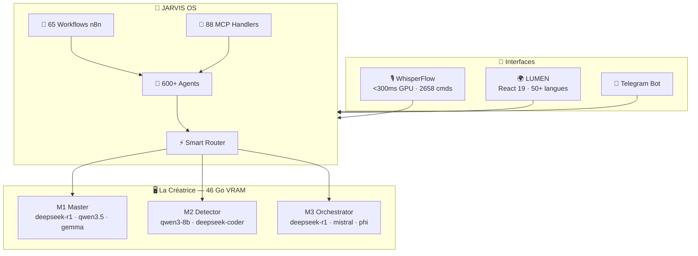

<div align="center">


# Franck Delmas — AI Systems Architect

> *"I don't build demos. I ship AI systems that run in production."*

[](https://github.com/Turbo31150)
[](https://linkedin.com/in/franck-hlb-80bb231b1)
[](https://codeur.com/-6666zlkh)
[](https://turbo31150.github.io/franckdelmas.dev/)


</div>

---

## 🔥 Stack en chiffres — Production, pas du PoC

```
┌──────────────────────────────────────────────────────┐
│  🤖  600+   agents IA autonomes en production        │
│  🎙️  2 658  commandes vocales reconnues              │
│  🔧   88    MCP tool handlers                        │
│  🗄️  103    bases SQLite managées                    │
│  ⚡    65    workflows n8n automatisés                │
│  💻  320K   lignes de code dans l'écosystème         │
│  🎮    6    GPUs NVIDIA — 46 Go VRAM                 │
│  🧠   21    modèles IA disponibles en local          │
│  ✅   99.7% uptime cluster (depuis Jan 2026)         │
│  🏆    1    victoire Hackathon Airia AI Agents 2026  │
└──────────────────────────────────────────────────────┘
```

---

## 🏗️ Architecture JARVIS Ecosystem



---

## 🚀 Projets

| Projet | Description | Stars | Stack |
|--------|-------------|:-----:|-------|
| [🤖 JARVIS OS](https://github.com/Turbo31150/jarvis-linux) | Distributed AI OS — 600+ agents, 6 GPUs, 99.7% uptime | ⭐3 | Python · Docker · CUDA |
| [⚙️ JARVIS Core](https://github.com/Turbo31150/jarvis-core) | Unified orchestration — 26 modules, 45/45 tasks ✅ | NEW | Python · MCP · WebSocket |
| [📈 TradeOracle](https://github.com/Turbo31150/tradeoracle) | Multi-model AI consensus trading engine | ⭐1 | Python · CUDA · TA-Lib |
| [🎙️ WhisperFlow](https://github.com/Turbo31150/jarvis-whisper-flow) | Voice AI — 2658 cmds, <300ms, 97.5% accuracy | ⭐1 | Python · Whisper · CUDA |
| [🌍 LUMEN](https://github.com/Turbo31150/lumen) | Live transcription — 50+ langs, 96.4% confidence | — | React 19 · TypeScript · Vite 7 |
| [📊 Turbo Dashboard](https://github.com/Turbo31150/turbo-dashboard) | GPU cluster monitoring — cyberpunk UI | ⭐4 | React · WebSocket · Chart.js |
| [🛡️ Aria Sentinel](https://github.com/Turbo31150/aria-agents-hackathon) | Multi-Agent Treasury Risk — 🏆 Hackathon Airia 2026 | 🥇 | Python · FastAPI · Monte Carlo |

---

## 💼 Services Freelance — 55€/h · Remote · Démarrage 48h

| Service | Inclus | Tarif |
|---------|--------|-------|
| 🤖 Agents IA Autonomes | Pipeline complet, 24h/24, auto-réparation | dès 2 000€ |
| 🎙️ Voice AI | Speech-to-action <300ms, local, zéro cloud | dès 3 500€ |
| ⚙️ Automatisation Métier | n8n/Python, APIs, CRM, Telegram | Sur devis |
| 🖥️ Infrastructure IA | Cluster GPU, modèles, optimisation Linux | 55€/h |

[](https://codeur.com/-6666zlkh)

---

## 🏆 Achievements

| | Réalisation |
|--|------------|
| 🥇 | Hackathon Airia AI Agents 2026 — Lauréat Aria Sentinel (Multi-Agent Treasury Risk) |
| ⚡ | OMEGA v3.2 — SQL +2250%, NVMe +105%, RAM +41%, GPU -33% latency — zéro euro investi |
| 🤖 | 600+ agents IA en production continue depuis Janvier 2026 — 99.7% uptime |
| 📦 | 20 repos open source — documentés, testés, publics MIT |
| 🎙️ | 2658 commandes vocales reconnues <300ms sur GPU |
| 💰 | ~15€/mois cluster vs 200-500€/mois API cloud — ROI 3-5 mois |

---

## 📊 GitHub Stats

<div align="center">


</div>

---

## 🖥️ Infrastructure — "La Créatrice"

```
┌────────────────────────────────────────────────────────┐
│  M1 MASTER    RTX 3080 (10GB) + RTX 2060 (6GB) = 16GB │
│               deepseek-r1 · qwen3.5-9b · gemma-3-4b    │
├────────────────────────────────────────────────────────┤
│  M2 DETECTOR  4× GTX 1660 Super = 24 GB               │
│               qwen3-8b · deepseek-coder · nemotron     │
├────────────────────────────────────────────────────────┤
│  M3 ORCH.     2× GTX 1660 Super = 12 GB (+ OL1)       │
│               deepseek-r1 · mistral-7b · phi-3.1       │
├────────────────────────────────────────────────────────┤
│  TOTAL  6 GPUs · 46 GB VRAM · 21 modèles · 99.7% UP   │
└────────────────────────────────────────────────────────┘
Failover : M3 → OL1 → M1 → M2 → Gemini → Claude
```

---

## 📬 Contact

<div align="center">

| Canal | Lien | Réponse |
|-------|------|:-------:|
| 💼 Freelance | [codeur.com/-6666zlkh](https://codeur.com/-6666zlkh) | <24h |
| 💌 LinkedIn | [franck-hlb-80bb231b1](https://linkedin.com/in/franck-hlb-80bb231b1) | <12h |
| 📧 Email | franckdelmas00@gmail.com | <24h |
| 🐙 GitHub | Issues & Discussions bienvenues | <48h |

*📍 Toulouse, France · 🇫🇷 French (native) · 🇬🇧 English (professional)*

---

**MIT License · © 2026 Franck Delmas · Everything open source. Everything local.**

*"The best way to prove your skills is to show your work."*

</div>
