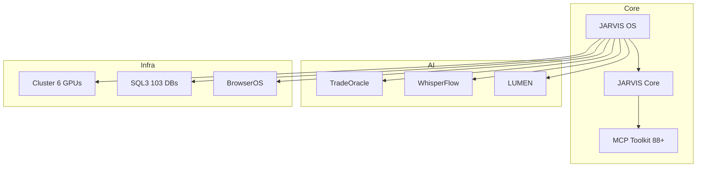

<div align="center">


# Franck Delmas — AI Systems Architect

[](https://github.com/Turbo31150)
[](https://turbo31150.github.io/franckdelmas.dev/)
[](https://linkedin.com/in/franck-hlb-80bb231b1)
[](https://codeur.com/-6666zlkh)

**I build production-grade AI systems that actually work.**

</div>


## JARVIS Ecosystem



## What I Build

| Project | Description | Stars |
|---------|-------------|-------|
| [**JARVIS OS**](https://github.com/Turbo31150/jarvis-linux) | Distributed AI Operating System — 600+ agents, 6 GPUs | ⭐3 |
| [**JARVIS Core**](https://github.com/Turbo31150/jarvis-core) | Unified orchestration — 26 modules, 9 agents, 45/45 tasks | NEW |
| [**TradeOracle**](https://github.com/Turbo31150/TradeOracle) | Multi-model AI consensus trading engine | ⭐1 |
| [**WhisperFlow**](https://github.com/Turbo31150/jarvis-whisper-flow) | Real-time Voice AI — <300ms on GPU | ⭐1 |
| [**LUMEN**](https://github.com/Turbo31150/lumen) | Live multilingual transcription — 50+ languages | |
| [**Turbo Dashboard**](https://github.com/Turbo31150/turbo) | GPU cluster monitoring — cyberpunk UI | ⭐4 |

## Infrastructure

**"La Créatrice"** — 6 NVIDIA GPUs (RTX 3080 + RTX 2060 + 4x GTX 1660S), 46GB VRAM, 3 machines.

```
M1 Master:  deepseek-r1, qwen3.5-9b, gemma-3-4b
M2 Detector: qwen3-8b, deepseek-coder, nemotron
M3 Orchestrator: deepseek-r1, mistral-7b, phi-3.1
```

## Tech Stack

`Python` `TypeScript` `CUDA` `Docker` `Linux` `React` `n8n` `MCP` `SQLite` `WebSocket`

## Hire Me

55€/h · Remote · [Portfolio](https://turbo31150.github.io/franckdelmas.dev/) · [Codeur.com](https://codeur.com/-6666zlkh)


---

MIT License · © 2026 Franck Delmas
